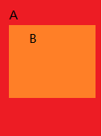

<font size=4 color=#D2691E> 谈一谈事件传递 2019年05月12日 </font>

安卓手机大部分都是触屏手机，我们通过触摸事件来实现交互，所以很有必要搞明白Touch事件。<br>

Touch事件有三种，按下，移动，和抬起。<br>

* 一，Android事件序列
    * 1.按下->中间n次移动(n>=0)->抬起 为一个事件序列。
    * 2.按下->中间n次移动(n>=0)->取消 为一个事件序列。
* 二，我们假设屏幕上只有一个占满屏幕的View，Touch事件怎么设计呢？
   * 1.手指按下屏幕 -> view能收到按下事件。
   * 2.手指移动 -> view能收到移动事件。
   * 3.手指抬起 -> view能收到抬起事件。
   * 总结：只有一个View的情况，比较简单。
* 三，我们假设屏幕上有两层View，外层为A，内层为B，Touch事件怎么设计呢？<br>
  * 
  * 1.手指按下，我们要判断按到了谁上面，A?B?，我们假设我们按在了B上。
  * 2.如果B想处理这个事件，B就处理，如果B不想处理，A可以处理。
  * 3.如果A想处理这个事件，不想让B处理，则A拦下此事件，A处理。
  * 4.如果B不想让A拦截事件，B可以设置A不允许处理。
* 四，上一步骤中的第一步，判断点到谁上面，Android的源码太复杂了，涉及到多点触控以及分屏，所以不模拟实现了，我们模拟一下上一步骤中的第2小步。<br>
“如果B想处理这个事件，B就处理，如果B不想处理，A可以处理”<br>
按下事件完成以后，会生成一个touch链，A->B。我们的例子中为 A->B->C->D ，见下面代码 Moudle-testtouchevent1 <br>

    TouchView
    ```java
    /**
    * TouchView
    *
    * @author chengxiaobo
    * @time 2019/5/11 21:22
    */
    class TouchView(val name: String) {

        //是否处理touch事件
        var isDealTouch = false

        fun onTouchEvent(): Boolean {
            loge("$name  isDealTouch  $isDealTouch")
            return isDealTouch
        }
    }
    ```
    TouchTarget
    ```java
    /**
    * TouchTarget
    *
    * @author chengxiaobo
    * @time 2019/5/11 21:20
    */
    class TouchTarget(val name: String) {

        var next: TouchTarget? = null
        val touchView = TouchView(name)
    }
    ```

    TestTouchEvent1Activity
    ```java
    /**
    *
    * @author chengxiaobo
    * @time 2019/5/11 21:10
    */
    class TestTouchEvent1Activity : AppCompatActivity() {

        override fun onCreate(savedInstanceState: Bundle?) {
            super.onCreate(savedInstanceState)
            setContentView(R.layout.activity_test_touch_event1)
            val touchTargetA = TouchTarget("A")
            val touchTargetB = TouchTarget("B")
            val touchTargetC = TouchTarget("C")
            val touchTargetD = TouchTarget("D")

            touchTargetA.next = touchTargetB
            touchTargetB.next = touchTargetC
            touchTargetC.next = touchTargetD

            touchTargetA.touchView.isDealTouch = false
            touchTargetB.touchView.isDealTouch = true
            touchTargetC.touchView.isDealTouch = false
            touchTargetD.touchView.isDealTouch = false

            btnClick.setOnClickListener {
                dispatchTouchEvent(touchTargetA)
            }

        }

        /**
        * 模拟事件分发-很有意思，递归递归递归
        */
        private fun dispatchTouchEvent(touchTarget: TouchTarget): Boolean {
            val next = touchTarget.next
            return if (next == null) {
                touchTarget.touchView.onTouchEvent()
            } else {
                val isDeal = dispatchTouchEvent(touchTarget.next!!)
                if (isDeal) {
                    true
                } else {
                    touchTarget.touchView.onTouchEvent()
                }
            }
        }
    }               
    ```

    运行结果
    ```java
    05-12 09:49:59.288 3550-3550/com.example.cheng.testtouchevent1 E/TestTouchEvent1: 
    D  isDealTouch  false
    C  isDealTouch  false
    B  isDealTouch  true
    ```

    总结
    ```java
    dispatchTouchEvent 用来模拟事件分发。自己尝试写了一次，发现很有意思。如果尝试写的同学，可以琢磨琢磨。
    ```


  


