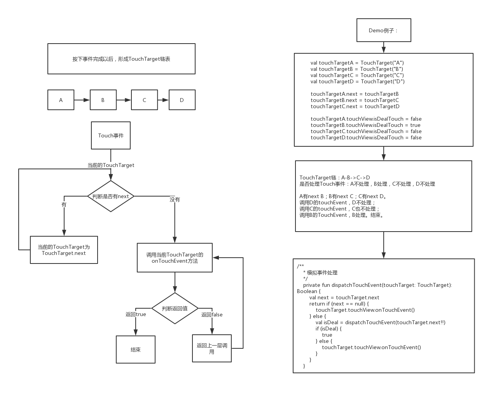
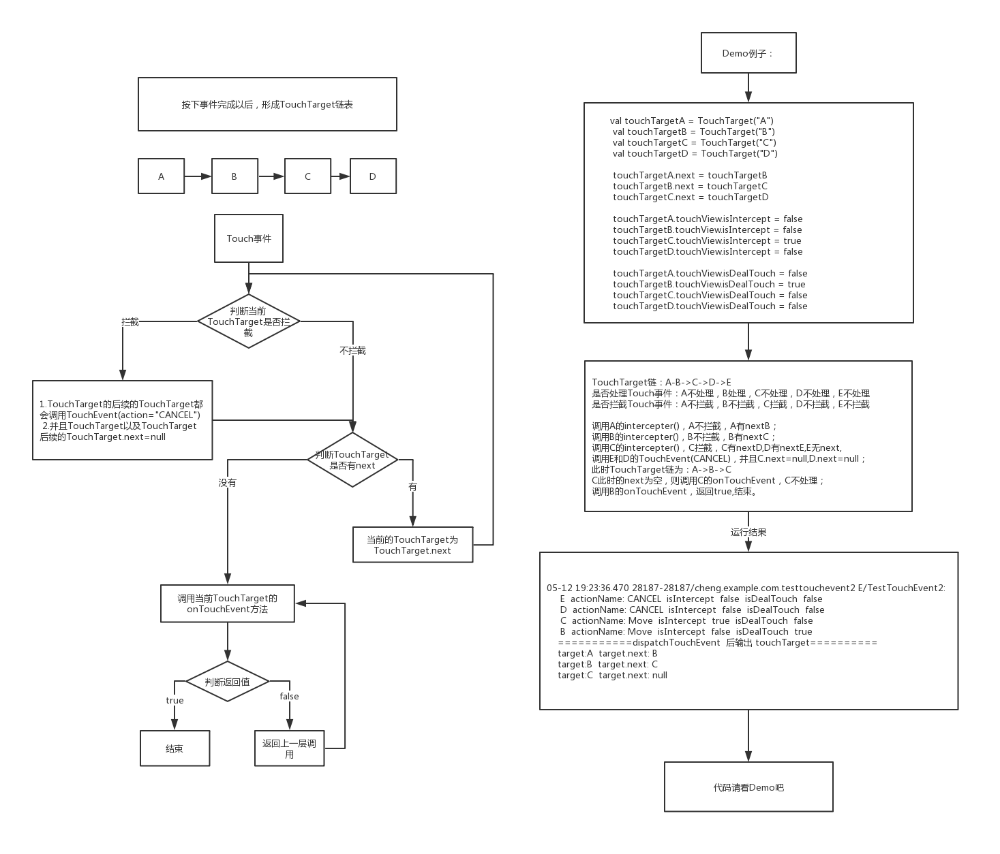

<font size=4 color=#D2691E> 谈一谈事件传递 2019年05月12日 </font>

安卓手机大部分都是触屏手机，我们通过触摸事件来实现交互，所以很有必要搞明白Touch事件。<br>

Touch事件有三种，按下，移动，和抬起。<br>

* 一，Android事件序列
    * 1.按下->中间n次移动(n>=0)->抬起 为一个事件序列。
    * 2.按下->中间n次移动(n>=0)->取消 为一个事件序列。
* 二，我们假设屏幕上只有一个占满屏幕的View，Touch事件怎么设计呢？
   * 1.手指按下屏幕 -> view能收到按下事件。
   * 2.手指移动 -> view能收到移动事件。
   * 3.手指抬起 -> view能收到抬起事件。
   * 总结：只有一个View的情况，比较简单。
* 三，我们假设屏幕上有两层View，外层为A，内层为B，Touch事件怎么设计呢？<br>
  * 
  * 1.手指按下，我们要判断按到了谁上面，A?B?，我们假设我们按在了B上。
  * 2.如果B想处理这个事件，B就处理，如果B不想处理，A可以处理。
  * 3.如果A想处理这个事件，不想让B处理，则A拦下此事件，A处理。
  * 4.如果B不想让A拦截事件，B可以设置A不允许处理。
* 四，上一步骤中的第一步，判断点到谁上面，Android的源码太复杂了，涉及到多点触控以及分屏，所以不模拟实现了，我们模拟一下上一步骤中的第2小步。<br>
“如果B想处理这个事件，B就处理，如果B不想处理，A可以处理”<br>
按下事件完成以后，会生成一个touch链，A->B。我们的例子中为 A->B->C->D <br>
见下面代码 Moudle-testtouchevent1 (模拟事件处理) <br>

    TouchView

    ```java
    /**
    * TouchView
    *
    * @author chengxiaobo
    * @time 2019/5/11 21:22
    */
    class TouchView(val name: String) {

        //是否处理touch事件
        var isDealTouch = false

        fun onTouchEvent(): Boolean {
            loge("$name  isDealTouch  $isDealTouch")
            return isDealTouch
        }
    }
    ```

    TouchTarget

    ```java
    /**
    * TouchTarget
    *
    * @author chengxiaobo
    * @time 2019/5/11 21:20
    */
    class TouchTarget(val name: String) {

        var next: TouchTarget? = null
        val touchView = TouchView(name)
    }
    ```

    TestTouchEvent1Activity

    ```java
    /**
    *
    * @author chengxiaobo
    * @time 2019/5/11 21:10
    */
    class TestTouchEvent1Activity : AppCompatActivity() {

        override fun onCreate(savedInstanceState: Bundle?) {
            super.onCreate(savedInstanceState)
            setContentView(R.layout.activity_test_touch_event1)
            val touchTargetA = TouchTarget("A")
            val touchTargetB = TouchTarget("B")
            val touchTargetC = TouchTarget("C")
            val touchTargetD = TouchTarget("D")

            touchTargetA.next = touchTargetB
            touchTargetB.next = touchTargetC
            touchTargetC.next = touchTargetD

            touchTargetA.touchView.isDealTouch = false
            touchTargetB.touchView.isDealTouch = true
            touchTargetC.touchView.isDealTouch = false
            touchTargetD.touchView.isDealTouch = false

            btnClick.setOnClickListener {
                dispatchTouchEvent(touchTargetA)
            }

        }

        /**
        * 模拟事件处理-很有意思，递归递归递归
        */
        private fun dispatchTouchEvent(touchTarget: TouchTarget): Boolean {
            val next = touchTarget.next
            return if (next == null) {
                touchTarget.touchView.onTouchEvent()
            } else {
                val isDeal = dispatchTouchEvent(touchTarget.next!!)
                if (isDeal) {
                    true
                } else {
                    touchTarget.touchView.onTouchEvent()
                }
            }
        }
    }               
    ```
   
    运行结果

    ```java
    05-12 09:49:59.288 3550-3550/com.example.cheng.testtouchevent1 E/TestTouchEvent1: 
    D  isDealTouch  false
    C  isDealTouch  false
    B  isDealTouch  true
    ```
    流程图<br>
    <br>

    总结

    ```java
    dispatchTouchEvent 用来模拟事件处理流程。
    
    TouchTarget链：A-B->C->D 
    是否处理Touch事件：A不处理，B处理，C不处理，D不处理

    A有next B；B有next C；C有next D。
    调用D的touchEvent，D不处理；
    调用C的touchEvent，C也不处理；
    调用B的TouchEvent，B处理。结束。

    自己尝试写了一次，发现还挺有意思。如果尝试写的同学，可以琢磨琢磨。
    ```
* 五，模拟第三步的第2小步，“如果A想处理这个事件，不想让B处理，则A拦下此事件，A处理。” <br>

    补充说明一下流程：
  * 如果A拦截Touch事件，会调用B的TouchEvent(action="CANCEL"),A.next=null 
  * 更准确的说是 TouchTarget的后续的TouchTarget都会调用TouchEvent(action="CANCEL"),并且TouchTarget以及TouchTarget后续的TouchTarget.next=null<br> 

   见下面代码 Moudle-testtouchevent2 (模拟事件处理+拦截) <br>

   TouchView
   ```java
    /**
    * TouchView
    *
    * @author chengxiaobo
    * @time 2019/5/12 10:04
    */
    class TouchView(val name: String) {

        //是否处理touch事件
        var isDealTouch = false
        var isIntercept = false

        fun onTouchEvent(actionName: String = "Move"): Boolean {
            loge(" $name  actionName: $actionName  isIntercept  $isIntercept  isDealTouch  $isDealTouch")
            return isDealTouch
        }

        fun intercepter(): Boolean {
            return isIntercept
        }
    }
   ```

  TouchTarget
   ```java
    /**
    * TouchTarget
    *
    * @author chengxiaobo
    * @time 2019/5/12 10:04
    */
    class TouchTarget(val name: String) {

        var next: TouchTarget? = null
        val touchView = TouchView(name)
    }
   ```
  TestTouchEvent2Activity
   ```java
    /**
    * TestTouchEvent2Activity
    *
    * @author chengxiaobo
    * @time 2019/5/12 10:08
    */
    class TestTouchEvent2Activity : AppCompatActivity() {

        val CANCEL = "CANCEL"
        override fun onCreate(savedInstanceState: Bundle?) {
            super.onCreate(savedInstanceState)
            setContentView(R.layout.activity_test_touch_event2)

            val touchTargetA = TouchTarget("A")
            val touchTargetB = TouchTarget("B")
            val touchTargetC = TouchTarget("C")
            val touchTargetD = TouchTarget("D")
            val touchTargetE = TouchTarget("E")

            touchTargetA.next = touchTargetB
            touchTargetB.next = touchTargetC
            touchTargetC.next = touchTargetD
            touchTargetD.next = touchTargetE

            touchTargetA.touchView.isIntercept = false
            touchTargetB.touchView.isIntercept = false
            touchTargetC.touchView.isIntercept = true
            touchTargetD.touchView.isIntercept = false
            touchTargetE.touchView.isIntercept = false

            touchTargetA.touchView.isDealTouch = false
            touchTargetB.touchView.isDealTouch = true
            touchTargetC.touchView.isDealTouch = false
            touchTargetD.touchView.isDealTouch = false
            touchTargetE.touchView.isDealTouch = false

            btnClick.setOnClickListener {
                dispatchTouchEvent(touchTargetA)
                loge("===========dispatchTouchEvent  后输出 touchTarget==========")
                printTouchTarget(touchTargetA)
            }

        }

        /**
        * 模拟事件分发+拦截 很有意思，递归递归递归
        */
        private fun dispatchTouchEvent(touchTarget: TouchTarget): Boolean {
            if (touchTarget.touchView.intercepter()) {
                //1.TouchTarget的后续的TouchTarget都会调用TouchEvent(action="CANCEL")
                //2.并且TouchTarget以及TouchTarget后续的TouchTarget.next=null
                touchTarget.next?.let {
                    cancelTargetNext(it)
                    touchTarget.next = null
                }

            }
            val next = touchTarget.next
            return if (next == null) {
                touchTarget.touchView.onTouchEvent()
            } else {
                val isDeal = dispatchTouchEvent(touchTarget.next!!)
                if (isDeal) {
                    true
                } else {
                    touchTarget.touchView.onTouchEvent()
                }
            }
        }

        /**
        * 1.TouchTarget的后续的TouchTarget都会调用TouchEvent(action="CANCEL")
        * 2.并且TouchTarget以及TouchTarget后续的TouchTarget.next=null
        * 又是递归，递归，递归。哈哈哈哈
        */
        private fun cancelTargetNext(touchTarget: TouchTarget) {
            while (touchTarget.next != null) {
                cancelTargetNext(touchTarget.next!!)
                touchTarget.next = null
                touchTarget.touchView.onTouchEvent(CANCEL)
                return
            }
            touchTarget.touchView.onTouchEvent(CANCEL)
        }

        private fun printTouchTarget(touchTarget: TouchTarget) {
            var currentTouchTarget: TouchTarget? = touchTarget
            while (currentTouchTarget != null) {
                var name = "null"
                if (currentTouchTarget.next != null) {
                    name = currentTouchTarget.next!!.name
                }
                loge("target:${currentTouchTarget.name}  target.next: ${name}")
                currentTouchTarget = currentTouchTarget.next
            }

        }
    }
   ```
   运行结果
   ```java
   05-12 19:23:36.470 28187-28187/cheng.example.com.testtouchevent2 E/TestTouchEvent2:  
     E  actionName: CANCEL  isIntercept  false  isDealTouch  false
     D  actionName: CANCEL  isIntercept  false  isDealTouch  false
     C  actionName: Move  isIntercept  true  isDealTouch  false
     B  actionName: Move  isIntercept  false  isDealTouch  true
    ===========dispatchTouchEvent  后输出 touchTarget==========
    target:A  target.next: B
    target:B  target.next: C
    target:C  target.next: null
   ```
   流程图：
   <br>
   总结：
   ```java
    dispatchTouchEvent 用来模拟事件处理+拦截流程。

    TouchTarget链：A-B->C->D->E 
    是否处理Touch事件：A不处理，B处理，C不处理，D不处理，E不处理
    是否拦截Touch事件：A不拦截，B不拦截，C拦截，D不拦截，E不拦截

    调用A的intercepter()，A不拦截，A有nextB；
    调用B的intercepter()，B不拦截，B有nextC；
    调用C的intercepter()，C拦截，C有nextD,D有nextE,E无next,
    调用E和D的TouchEvent(CANCEL)，并且C.next=null,D.next=null；
    此时TouchTarget链为：A->B->C
    C此时的next为空，则调用C的onTouchEvent，C不处理；
    调用B的onTouchEvent，返回true,结束。

    自己尝试写了一次，发现很有意思，各种递归，如果尝试写的同学，可以琢磨琢磨。
   ```


  


